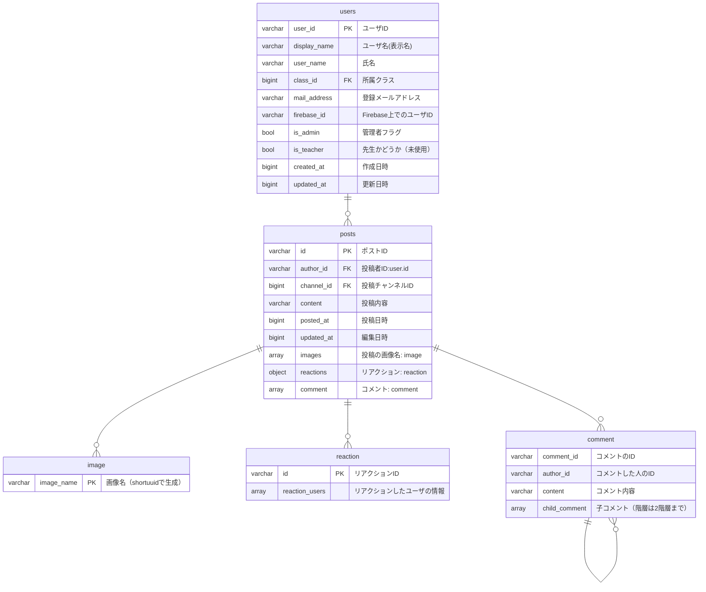

# DB設計

## 共通事項
> [!NOTE]
> - オブジェクトを識別するためのIDは**文字列**とし、ユーザが任意に入力するか、もしくはshortuuidを使用する。
> - タイムスタンプはUNIX時間をbigintとして記録する。

## ER図

```mermaid
erDiagram
  %% モデル
  users {
    varchar user_id PK "ユーザID"
    varchar display_name "ユーザ名(表示名)"
    varchar user_name "氏名"
    bigint class_id FK "所属クラス"
    varchar mail_address "登録メールアドレス"
    varchar firebase_id "Firebase上でのユーザID"

    bool is_admin "管理者フラグ"
    bool is_teacher "先生かどうか（未使用）"

    bigint created_at "作成日時"
    bigint updated_at "更新日時"
  }

  posts {
    varchar id PK "ポストID"
    varchar author_id FK "投稿者ID:user.id"
    bigint channel_id FK "投稿チャンネルID"

    varchar content "投稿内容"
    bigint posted_at "投稿日時"
    bigint updated_at "編集日時"

    array images "投稿の画像名: image"
    object reactions "リアクション: reaction"
    array comment "コメント: comment"
  }

  image {
    varchar image_name PK "画像名（shortuuidで生成）"
  }

  reaction {
    varchar id PK "リアクションID"
    array reaction_users "リアクションしたユーザの情報"
  }

  comment {
    varchar comment_id "コメントのID"
    varchar author_id "コメントした人のID"
    varchar content "コメント内容"
    array child_comment "子コメント（階層は2階層まで）"
  }

  %% 関係性
  users ||--o{ posts : ""
  posts ||--o{ image: ""
  posts ||--o{ reaction: ""
  posts ||--o{ comment: ""
  comment ||--o{ comment: ""

```
